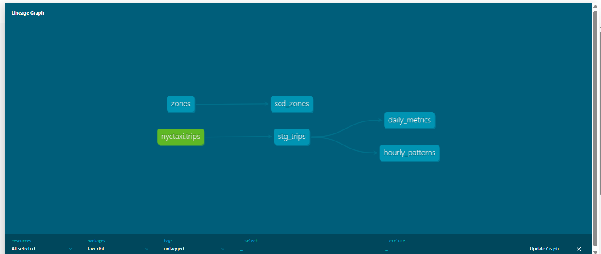

# NYC Taxi — dbt Analytics Engineering Project


A dbt project that transforms the public `samples.nyctaxi.trips` dataset on
Databricks into clean, tested, business-ready models following a layered
(staging → marts) architecture.

This is the **dbt / transformation-layer** companion to my Databricks medallion
implementation of the same dataset:
👉 [nyc-taxi-analytics-databricks](https://github.com/OliveriGuido/nyc-taxi-analytics-databricks)

---

## Stack

- **dbt Core** with the **dbt-databricks** adapter
- **Databricks** (Delta Lake, Unity Catalog) as the warehouse
- Source data: `samples.nyctaxi.trips` (NYC yellow taxi trips)

---

## Architecture

The project follows dbt's standard layered design. Dependencies are resolved
automatically by dbt from the `ref()` / `source()` calls — there is no manual
run ordering.

```
samples.nyctaxi.trips (source)
        │
        ▼
   stg_trips (staging · view)          ← cleaning + enrichment
        │
        ├──────────────► daily_metrics (mart · incremental)
        └──────────────► hourly_patterns (mart · table)

   zones (seed) ──────► scd_zones (snapshot · SCD Type 2)
```



---

## Layers

| Layer | Object | Materialization | Purpose |
|-------|--------|-----------------|---------|
| Source | `nyctaxi.trips` | — | Raw NYC taxi trips |
| Staging | `stg_trips` | view | Outlier filtering + derived columns (date, hour, duration) |
| Mart | `daily_metrics` | **incremental** | Daily aggregated KPIs (revenue, trips, avg fare) |
| Mart | `hourly_patterns` | table | Trip patterns by hour of day |
| Seed | `zones` | table | Small ZIP → zone lookup dimension |
| Snapshot | `scd_zones` | snapshot | SCD Type 2 history of the zones dimension |

---

## dbt features demonstrated

- **`source()` / `ref()`** — no hardcoded table names; dependencies build the DAG.
- **Materializations** — `view` for staging, `table` for marts, `incremental` where rebuild cost matters.
- **Incremental model** — `daily_metrics` uses `is_incremental()` + `unique_key` to `MERGE` only the recent window instead of a full rebuild.
- **Data tests** — `not_null`, `unique`, `accepted_values`, and `relationships` guard grain and referential integrity, run on every `dbt build`.
- **Snapshots (SCD Type 2)** — `scd_zones` versions dimension changes with `dbt_valid_from` / `dbt_valid_to` using the `check` strategy.
- **Docs & lineage** — `dbt docs generate` produces the lineage graph and column-level documentation.

---

## How to run

```bash
# from the project directory, with the dbt virtualenv active
dbt debug          # verify the Databricks connection
dbt build          # run + test all models in dependency order
dbt snapshot       # capture dimension changes (SCD2)
dbt docs generate  # build documentation
dbt docs serve     # browse docs + lineage locally
```

Connection settings live in `~/.dbt/profiles.yml` (not committed).

---

## Production considerations

For a production deployment, the incremental model would run on a scheduler (e.g. dbt Cloud, Airflow, or Dagster) for daily orchestration.

---

## Notes

This is a personal, project-scope implementation built to demonstrate
analytics-engineering fundamentals on a real warehouse. It is not a
production-orchestrated pipeline.
